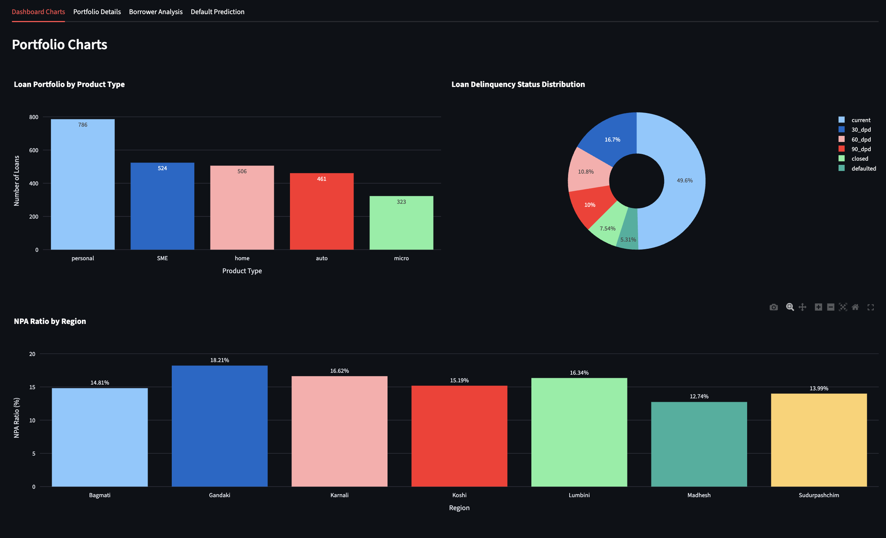
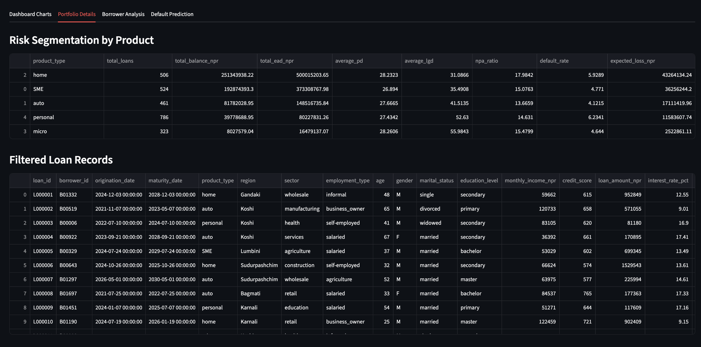
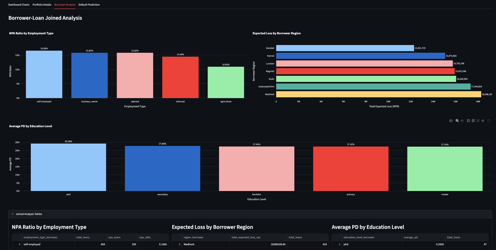
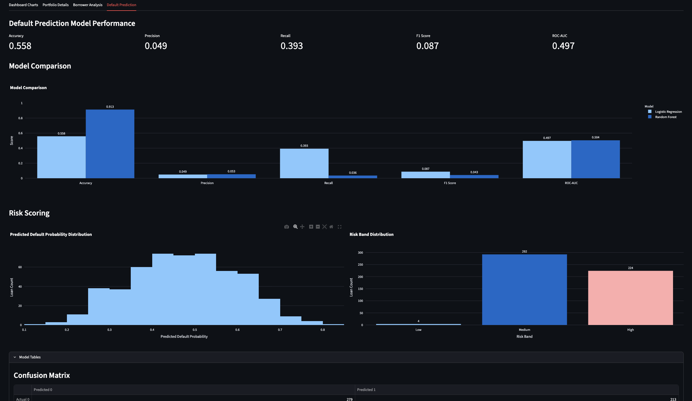

# Nepal Banking Risk Analytics Dashboard

A Streamlit-based credit risk analytics dashboard built on a Nepal-style banking dataset. The project analyzes loan portfolio health, borrower segmentation, expected loss, and baseline default prediction using an interactive web application.

## Live Demo

[Open the live dashboard](https://nepal-banking-risk-analytics.streamlit.app/)

## Features

- Portfolio KPI monitoring for total loans, outstanding balance, NPA ratio, default rate, EAD, expected loss, average PD, and average LGD
- Interactive portfolio filters by region, product type, and loan status
- Portfolio visualizations including product mix, delinquency distribution, NPA by region, origination trends, PD-LGD scatter, and vintage analysis
- Borrower-loan joined analysis with:
  - NPA ratio by employment type
  - expected loss by borrower region
  - average PD by education level
- Product-level risk segmentation and filtered loan record views
- CSV export of filtered loan data
- Baseline default prediction module using:
  - Logistic Regression
  - Random Forest comparison
  - predicted probability distribution
  - risk band distribution
  - feature importance table
  - top high-risk predicted loans

## Dashboard Structure

The app is organized into 4 tabs:

1. **Dashboard Charts**  
   Portfolio-level visualizations and credit risk charts
   ###Dashboard Charts 

3. **Portfolio Details**  
   Product-level segmentation and filtered loan records
   ###Portfolio Details 

5. **Borrower Analysis**  
   Joined borrower-loan analytics and borrower risk segmentation
   ###Borrower Analysis 

7. **Default Prediction**  
   Baseline machine learning models, model comparison, and risk scoring views
   ###Default Prediction 

## Tech Stack

- Python
- Streamlit
- Pandas
- Plotly
- Scikit-learn

## Project Structure

```text
Nepal Banking Risk Analytics Dashboard/
├── app.py
├── dataset/
│   ├── nepal_synthetic_bank_loans.csv
│   ├── nepal_synthetic_borrowers.csv
│   ├── nepal_synthetic_bank_dataset.csv
│   └── dataset_summary.csv
├── docs/
├── pages/
├── src/
│   ├── data_loader.py
│   ├── kpi_calculations.py
│   ├── charts.py
│   ├── filters.py
│   ├── portfolio_analysis.py
│   ├── export_utils.py
│   ├── borrower_analysis.py
│   ├── borrower_filters.py
│   ├── join_analysis.py
│   ├── model_data.py
│   └── default_model.py
├── .gitignore
└── Project Documentation and Technical Overview.pdf
├── README.md
└── requirements.txt
```

## Run Locally

```bash
python3 -m venv .venv
source .venv/bin/activate
pip install -r requirements.txt
streamlit run app.py
```

## Dataset

This project uses synthetic banking and borrower datasets created for portfolio analytics, dashboard development, and machine learning prototyping. The data is designed for learning and public portfolio use and does not contain real customer banking records.

## Modeling Note

The default prediction section is included as a baseline machine learning experiment. Logistic Regression and Random Forest models were trained on the synthetic dataset, but both achieved weak discriminatory performance, with ROC-AUC close to 0.5. This highlights the importance of realistic synthetic target generation, feature engineering, and careful evaluation under class imbalance.

## Why This Project Matters

This project combines:

- credit risk analytics
- dashboard design
- data filtering and export
- modular Python project structure
- borrower segmentation
- baseline machine learning evaluation

It is designed as a portfolio project that demonstrates practical analytics and software engineering skills in a banking risk context.
