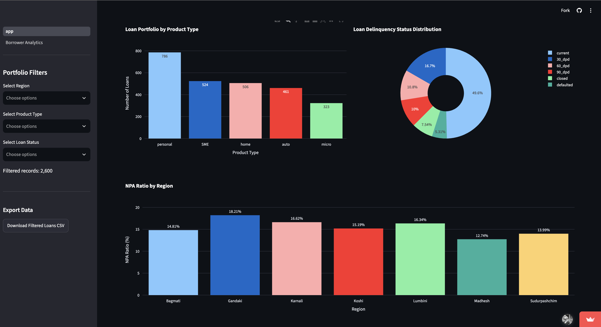
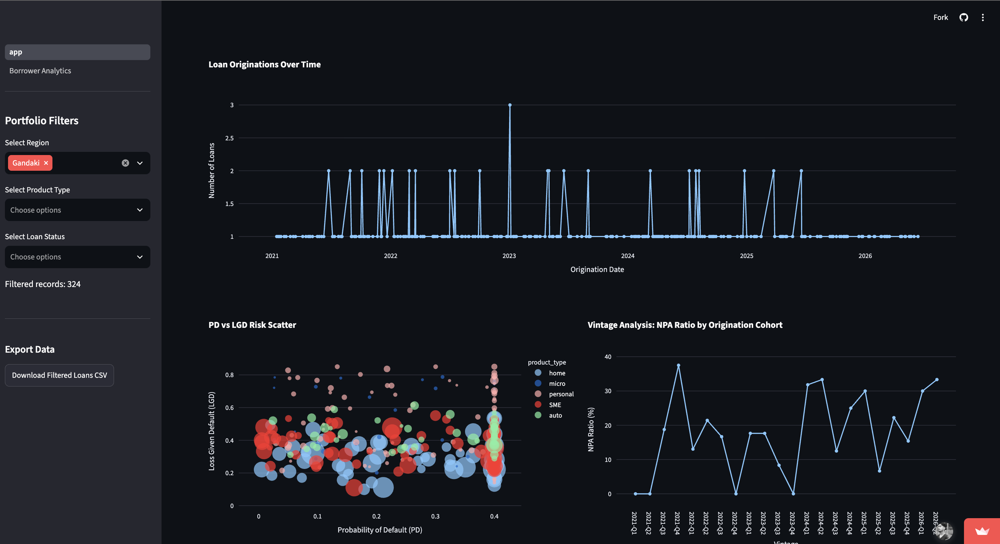
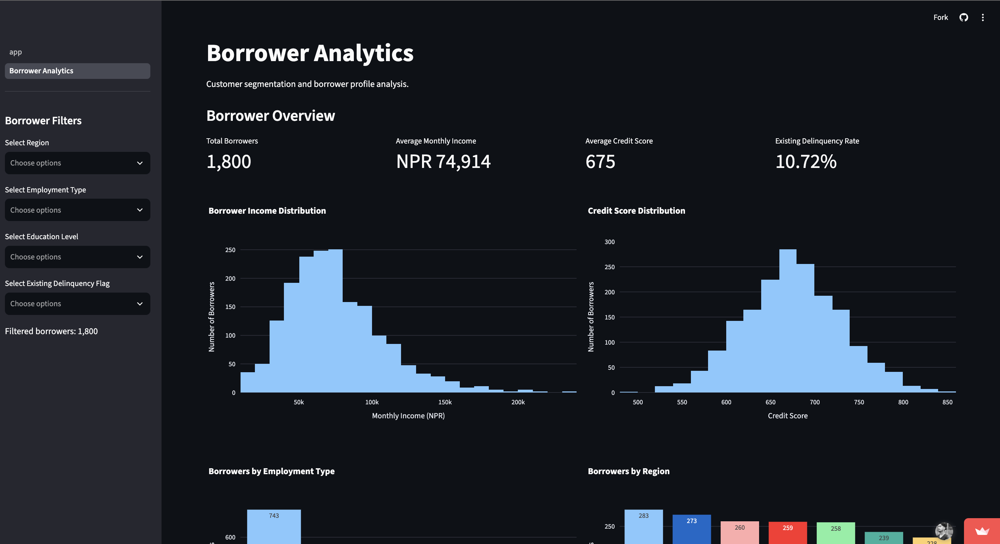

# Nepal Banking Risk Analytics Dashboard

A Streamlit-based credit risk analytics project built on a synthetic Nepal-style banking dataset. It tracks portfolio KPIs such as NPA ratio, default rate, PD, LGD, EAD, expected loss, and borrower-level segmentation.

## Live Demo
[Open the live dashboard](https://nepal-banking-risk-analytics.streamlit.app/)

## Features
- Portfolio KPI dashboard with filters
- Product, delinquency, regional, trend, PD-LGD, and vintage charts
- Borrower analytics page with demographic and income analysis
- Filtered CSV export
- Modular Python structure using `src/` and `pages/`

## Dashboard Screenshots

### Main Portfolio Dashboard


### Risk Visualizations


### Borrower Analytics Page


## Tech Stack
- Python
- Streamlit
- Pandas
- Plotly

## Project Structure
```bash
Nepal Banking Risk Analytics Dashboard/
├── app.py
├── dataset/
├── pages/
├── src/
├── docs/
├── README.md
└── requirements.txt
```

## Run Locally
```bash
python3 -m venv .venv
source .venv/bin/activate
pip install -r requirements.txt
streamlit run app.py
```

## Dataset
This project uses synthetic banking and borrower CSV files designed for portfolio analytics and dashboard development. The data is intended for learning, prototyping, and portfolio use.
